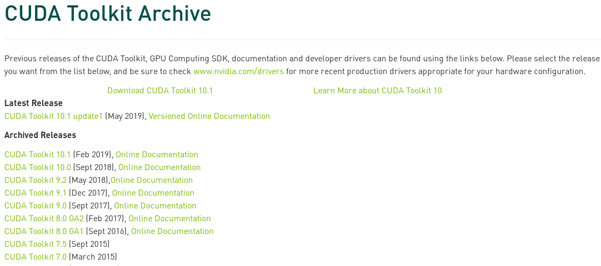
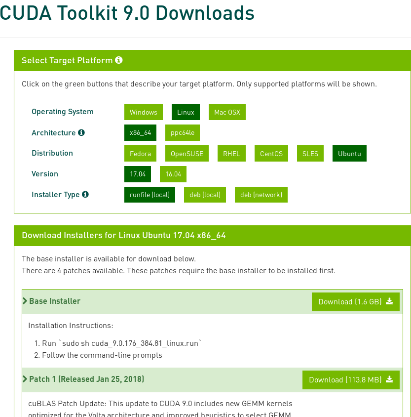
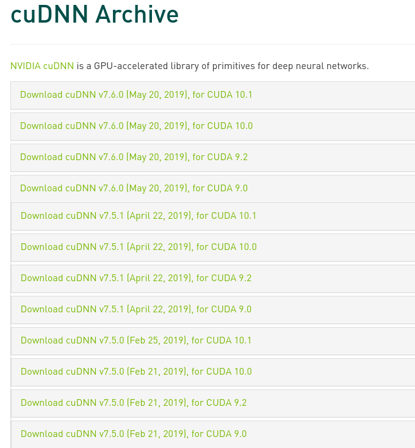

在本地开发与测试一些应用时，往往需要为不同的应用配置不同版本的TensorFlow，而这些不同版本的TensorFlow所依赖的CUDA版本也不太一致。本文以`CUDA 9.0 + cuDNN 7.0 + tensorflow-gpu 1.10.0`为例，尝试在Ubuntu上部署依赖特定CUDA版本的TensorFlow。通过本文的方法，其可以实现在同一个机器上通过虚拟环境部署多个版本的`tensorflow`，从而满足不同应用的环境需求。


# 一些准备工作

## 版本确认

在准备编译目标tensorflow时，需要先确认其CUDA和cuDNN版本以及其编译工具（gcc、bazel）的[支持情况][tensorflow-build]。bazel版本过高或过低都有可能导致编译失败，而cuda和cudnn版本不对会提示库缺失。

> last update: 2019-07-20
> 
> 版本 | Python 版本 | 编译器 | 编译工具 | cuDNN | CUDA
> --- | --- | --- | --- | --- | ---
> tensorflow_gpu-1.13.1 | 2.7、3.3-3.6 | GCC 4.8 | Bazel 0.19.2 | 7.4 | 10.0
> tensorflow_gpu-1.12.3 | 2.7、3.3-3.6 | GCC 4.8 | Bazel 0.19.2 | 7 | 9
> tensorflow_gpu-1.12.0 | 2.7、3.3-3.6 | GCC 4.8 | Bazel 0.15.0 | 7 | 9
> tensorflow_gpu-1.11.0 | 2.7、3.3-3.6 | GCC 4.8 | Bazel 0.15.0 | 7 | 9
> tensorflow_gpu-1.10.0 | 2.7、3.3-3.6 | GCC 4.8 | Bazel 0.15.0 | 7 | 9
> tensorflow_gpu-1.9.0 | 2.7、3.3-3.6 | GCC 4.8 | Bazel 0.11.0 | 7 | 9
> tensorflow_gpu-1.8.0 | 2.7、3.3-3.6 | GCC 4.8 | Bazel 0.10.0 | 7 | 9
> tensorflow_gpu-1.7.0 | 2.7、3.3-3.6 | GCC 4.8 | Bazel 0.9.0 | 7 | 9
> tensorflow_gpu-1.6.0 | 2.7、3.3-3.6 | GCC 4.8 | Bazel 0.9.0 | 7 | 9
> tensorflow_gpu-1.5.0 | 2.7、3.3-3.6 | GCC 4.8 | Bazel 0.8.0 | 7 | 9
> tensorflow_gpu-1.4.0 | 2.7、3.3-3.6 | GCC 4.8 | Bazel 0.5.4 | 6 | 8
> tensorflow_gpu-1.3.0 | 2.7、3.3-3.6 | GCC 4.8 | Bazel 0.4.5 | 6 | 8
> tensorflow_gpu-1.2.0 | 2.7、3.3-3.6 | GCC 4.8 | Bazel 0.4.5 | 5.1 | 8
> tensorflow_gpu-1.1.0 | 2.7、3.3-3.6 | GCC 4.8 | Bazel 0.4.2 | 5.1 | 8
> tensorflow_gpu-1.0.0 | 2.7、3.3-3.6 | GCC 4.8 | Bazel 0.4.2 | 5.1 | 8

**注意：TensorFlow从1.13开始不再支持CUDA 9，CUDA 10.0 需要 410.x 或更高版本的显卡驱动**

## （可选的）GCC

TensorFlow官方编译时使用的版本是gcc 4.8，如果需要和官方保持一直，可以单独安装。Ubuntu 18.04默认提供的gcc版本为7.4。

**注意：CUDA 9.0 依赖 gcc 4.8**

```sh
apt install gcc-4.8 g++-4.8
```

可以使用 `update-alternative` 对多个版本的gcc和g++进行切换。

```
update-alternatives <链接> <名称> <路径> <优先级>
```

添加gcc和g++，`update-alternatives` 会默认选择优先级最高的`gcc/g++`。
```
update-alternatives --install /usr/bin/gcc gcc /usr/bin/gcc-4.8 4
update-alternatives --install /usr/bin/gcc gcc /usr/bin/gcc-7 7
update-alternatives --install /usr/bin/g++ g++ /usr/bin/g++-4.8 4
update-alternatives --install /usr/bin/g++ g++ /usr/bin/g++-7 7
```

手动选择当前gcc和g++版本。
```
# update-alternatives --config gcc
有 2 个候选项可用于替换 gcc (提供 /usr/bin/gcc)。

  选择       路径            优先级  状态
------------------------------------------------------------
* 0            /usr/bin/gcc-7     7         自动模式
  1            /usr/bin/gcc-4.8   4         手动模式
  2            /usr/bin/gcc-7     7         手动模式

要维持当前值[*]请按<回车键>，或者键入选择的编号：1
update-alternatives: 使用 /usr/bin/gcc-4.8 来在手动模式中提供 /usr/bin/gcc (gcc)

# update-alternatives --config g++ 
有 2 个候选项可用于替换 g++ (提供 /usr/bin/g++)。

  选择       路径            优先级  状态
------------------------------------------------------------
* 0            /usr/bin/g++-7     7         自动模式
  1            /usr/bin/g++-4.8   4         手动模式
  2            /usr/bin/g++-7     7         手动模式

要维持当前值[*]请按<回车键>，或者键入选择的编号：1
update-alternatives: 使用 /usr/bin/g++-4.8 来在手动模式中提供 /usr/bin/g++ (g++)

# gcc --version
gcc (Ubuntu 4.8.5-4ubuntu8) 4.8.5
Copyright (C) 2015 Free Software Foundation, Inc.
This is free software; see the source for copying conditions.  There is NO
warranty; not even for MERCHANTABILITY or FITNESS FOR A PARTICULAR PURPOSE.

# g++ --version
g++ (Ubuntu 4.8.5-4ubuntu8) 4.8.5
Copyright (C) 2015 Free Software Foundation, Inc.
This is free software; see the source for copying conditions.  There is NO
warranty; not even for MERCHANTABILITY or FITNESS FOR A PARTICULAR PURPOSE.
```


## （可选的）CUDA & cuDNN

### 显卡驱动

Linux上的显卡驱动一直是一件比较痛苦的事情，同一个版本的驱动安装在不同的系统以及相同系统的不同小版本上都不一定能正常工作，因此需要尝试不同的版本，直至选择一个能够正常工作的版本。

对于Ubuntu而言，驱动的安装比较简单，可以使用自带的`ubuntu-drivers devices`命令查看合适的驱动，然后直接用`ubuntu-drivers install`进行安装。`ubuntu-drivers install`会自动安装推荐的驱动，这里也可以通过`apt`手动安装合适版本的驱动。驱动安装完毕后可以使用`nvidia-smi`进行检查。

```
# ubuntu-drivers devices
== /sys/devices/pci0000:00/0000:00:01.0/0000:01:00.0 ==
modalias : pci:v000010DEd00001CBAsv00001028sd00000831bc03sc00i00
vendor   : NVIDIA Corporation
driver   : nvidia-driver-390 - distro non-free recommended
driver   : xserver-xorg-video-nouveau - distro free builtin

# ubuntu-drivers install
```

通过`apt`安装指定版本的显卡驱动

```sh
sudo apt install nvidia-driver-390
```

源里的驱动一般版本较旧，如果想用新版的驱动，可以单独安装CUDA自带的或PPA的驱动。


### 手动下载安装 CUDA

打开[CUDA Toolkit Archive][CUDA]选择需要的版本。以CUDA 9.0为例，选择Ubuntu 17.04的runfile，下载安装文件以及对应的Patch。





打开[cuDNN Archive][cuDNN]选择需要的版本（下载cuDNN需要提前注册Nvidia的账户）。



下载得到的run文件可能缺乏可执行权限，需要手动进行添加。
```
chmod +x cuda-9.0.176_384.81_linux.run
```

静默安装 CUDA 9.0（需要将gcc版本切换为4.8！！！）
```sh
sudo ./cuda-9.0.176_384.81_linux.run --silent --toolkitpath=/usr/local/cuda-9.0.176 --samplespath=/usr/local/cuda-9.0.176/NVIDIA_CUDA-9.0_Samples --toolkit --samples
```

CUDA 9.0 安装时可能会提示缺少推荐库。
```sh
Missing recommended library: libXi.so
Missing recommended library: libXmu.so
```

对于缺少库所在包的名字，可以通过`apt-file`进行查找，然后使用apt安装即可。
```sh
sudo apt install libxi-dev libxmu-dev
```

CUDA 9.0安装完毕后，会自动在`/usr/local`创建一个指向`/usr/local/cuda-9.0.176`的软链接`/usr/local/cuda`。

在`/usr/local`下解压`cudnn-9.0-linux-x64-v7.tgz`，会自动将cudnn的文件放到`/usr/local/cuda`中。

```sh
cd /usr/local
sudo tar -xf ~/Downloads/nvidia/cudnn-9.0-linux-x64-v7.tgz 
```

如果需要继续安装其他版本的`CUDA`，则需要删除软链接`/usr/local/cuda`。

```sh
sudo rm /usr/local/cuda
```

### 使用 apt 安装 CUDA

如果只需要在全局安装单一版本，请使用`apt`方式进行安装。

添加Nvidia仓库
```
wget https://developer.download.nvidia.com/compute/cuda/repos/ubuntu1804/x86_64/cuda-repo-ubuntu1804_10.0.130-1_amd64.deb
sudo dpkg -i cuda-repo-ubuntu1804_10.0.130-1_amd64.deb
sudo apt-key adv --fetch-keys https://developer.download.nvidia.com/compute/cuda/repos/ubuntu1804/x86_64/7fa2af80.pub
sudo apt-get update
wget http://developer.download.nvidia.com/compute/machine-learning/repos/ubuntu1804/x86_64/nvidia-machine-learning-repo-ubuntu1804_1.0.0-1_amd64.deb
sudo apt install ./nvidia-machine-learning-repo-ubuntu1804_1.0.0-1_amd64.deb
sudo apt-get update
```

安装CUDA以及cuDNN，约4GB。
```
sudo apt-get install --no-install-recommends \
    cuda-10-0 \
    libcudnn7=7.6.0.64-1+cuda10.0  \
    libcudnn7-dev=7.6.0.64-1+cuda10.0
```

安装TensorRT，需要提前安装libcudnn7。TensorRT可缩短在某些模型上进行推断的延迟并提高吞吐量。
```
sudo apt-get update && \
    sudo apt-get install -y --no-install-recommends libnvinfer-dev=5.1.5-1+cuda10.0
```

> 参考
> - https://www.tensorflow.org/install/gpu

## （可选的）Bazel

**编译TensorFlow需要**

[Bazel][]是一个由Google开源的类似于Make，Maven和Gradle的开源构建和测试工具。TensorFlow就是通过它进行构建的，对于不同版本的TensorFlow应当选取合适版本的Bazel。可以在Github的[releases][bazel-github-releases]页面获取bazel的二进制版本，如`bazel-0.15.2-linux-x86_64`。

将下载的二进制文件放到`~/.local/bin`下，并赋予可执行权限，同时建立一个bazel的软链接，通过软链接使用不同版本的bazel。
```sh
cd ~/.local/bin
cp /path/to/bazel ./
chmod +x bazel-0.15.2-linux-x86_64
ln -s bazel-0.15.2-linux-x86_64 bazel
```

如果找不到bazel命令，请确保`~/.local/bin`位于`PATH`中。如果没有，则需要通过更新`PATH`。
```
export PATH=~/.local/bin:$PATH
```

也可以将上面这段代码插入`~/.bashrc`中，这样就不用每次手动更新`PATH`。


# TensorFlow 1.10.0

## 从源码构建

获取TensorFlow，并切换到v1.10.0分支。
```sh
git clone https://github.com/tensorflow/tensorflow.git
git checkout v1.10.0
```

TensorFlow 的依赖参见 https://github.com/tensorflow/tensorflow/blob/v1.10.0/tensorflow/tools/pip_package/setup.py

构建一个python虚拟环境用于编译tensorflow，并安装一些依赖。这里需要确保numpy的版本与tensorflow所支持的版本一致。
```sh
virtualenv -p /usr/bin/python3 pyenv/tensor
source pyenv/tensor/bin/activate
pip install pip six numpy==1.14.5 wheel setuptools mock future>=0.17.1
pip install keras_applications==1.0.6 --no-deps
pip install keras_preprocessing==1.0.5 --no-deps
```

运行`./configure`配置构建系统。由于这里只涉及单GPU，使用 NCCL 1.3 即可，TensorFlow会自动配置 NCCL 1.3。显卡计算能力，参见 https://developer.nvidia.com/cuda-gpus 。
```
./configure 
WARNING: --batch mode is deprecated. Please instead explicitly shut down your Bazel server using the command "bazel shutdown".
You have bazel 0.15.2 installed.
Please specify the location of python. [Default is /home/wkyo/project/pyenv/tensorflow/bin/python]: 


Traceback (most recent call last):
  File "<string>", line 1, in <module>
AttributeError: module 'site' has no attribute 'getsitepackages'
Found possible Python library paths:
  /home/wkyo/project/pyenv/tensorflow/lib/python3.6/site-packages
Please input the desired Python library path to use.  Default is [/home/wkyo/project/pyenv/tensorflow/lib/python3.6/site-packages]

Do you wish to build TensorFlow with jemalloc as malloc support? [Y/n]: 
jemalloc as malloc support will be enabled for TensorFlow.

Do you wish to build TensorFlow with Google Cloud Platform support? [Y/n]: 
Google Cloud Platform support will be enabled for TensorFlow.

Do you wish to build TensorFlow with Hadoop File System support? [Y/n]: 
Hadoop File System support will be enabled for TensorFlow.

Do you wish to build TensorFlow with Amazon AWS Platform support? [Y/n]: 
Amazon AWS Platform support will be enabled for TensorFlow.

Do you wish to build TensorFlow with Apache Kafka Platform support? [Y/n]: 
Apache Kafka Platform support will be enabled for TensorFlow.

Do you wish to build TensorFlow with XLA JIT support? [y/N]: 
No XLA JIT support will be enabled for TensorFlow.

Do you wish to build TensorFlow with GDR support? [y/N]: 
No GDR support will be enabled for TensorFlow.

Do you wish to build TensorFlow with VERBS support? [y/N]: 
No VERBS support will be enabled for TensorFlow.

Do you wish to build TensorFlow with OpenCL SYCL support? [y/N]: 
No OpenCL SYCL support will be enabled for TensorFlow.

Do you wish to build TensorFlow with CUDA support? [y/N]: y
CUDA support will be enabled for TensorFlow.

Please specify the CUDA SDK version you want to use. [Leave empty to default to CUDA 9.0]: 


Please specify the location where CUDA 9.0 toolkit is installed. Refer to README.md for more details. [Default is /usr/local/cuda]: /usr/local/cuda-9.0.176


Please specify the cuDNN version you want to use. [Leave empty to default to cuDNN 7.0]: 


Please specify the location where cuDNN 7 library is installed. Refer to README.md for more details. [Default is /usr/local/cuda-9.0.176]:


Do you wish to build TensorFlow with TensorRT support? [y/N]: 
No TensorRT support will be enabled for TensorFlow.

Please specify the NCCL version you want to use. If NCCL 2.2 is not installed, then you can use version 1.3 that can be fetched automatically but it may have worse performance with multiple GPUs. [Default is 2.2]: 1.3


Please specify a list of comma-separated Cuda compute capabilities you want to build with.
You can find the compute capability of your device at: https://developer.nvidia.com/cuda-gpus.
Please note that each additional compute capability significantly increases your build time and binary size. [Default is: 6.1]6.1


Do you want to use clang as CUDA compiler? [y/N]: 
nvcc will be used as CUDA compiler.

Please specify which gcc should be used by nvcc as the host compiler. [Default is /usr/bin/gcc]: 


Do you wish to build TensorFlow with MPI support? [y/N]: 
No MPI support will be enabled for TensorFlow.

Please specify optimization flags to use during compilation when bazel option "--config=opt" is specified [Default is -march=native]: 


Would you like to interactively configure ./WORKSPACE for Android builds? [y/N]: 
Not configuring the WORKSPACE for Android builds.

Preconfigured Bazel build configs. You can use any of the below by adding "--config=<>" to your build command. See tools/bazel.rc for more details.
        --config=mkl            # Build with MKL support.
        --config=monolithic     # Config for mostly static monolithic build.
Configuration finished
```

配置动态库搜索路径`LD_LIBRARY_PATH`
```sh
export LD_LIBRARY_PATH=/usr/local/cuda-9.0.176/lib64:/usr/local/cuda-9.0.176/extras/CUPTI/lib64:$LD_LIBRARY_PATH
```

构建支持 GPU 的 TensorFlow。官方 TensorFlow 软件包是使用 GCC 4 编译的，并使用旧版 ABI。对于 GCC 5 及更高版本，为了使编译系统与旧版 ABI 兼容，请使用 --cxxopt="-D_GLIBCXX_USE_CXX11_ABI=0"。但实际上 TensorFlow 1.10.0 最高仅支持使用GCC 5编译。

```sh
# 编译tensorflow
bazel build --config=opt --config=cuda //tensorflow/tools/pip_package:build_pip_package
# 生成带gpu后缀的python包
./bazel-bin/tensorflow/tools/pip_package/build_pip_package /tmp/tensorflow_pkg --gpu
```

## pip安装

### 建立虚拟环境并安装

建立python虚拟环境，并在该环境中安装指定版本的tensorflow-gpu（这里的tensorflow可以是自己编译的，也可以是来自pypi仓库的）。
```sh
# 建立虚拟环境tf1.10
virtualenv -p /usr/bin/python3 ~/pyenv/tf1.10
# 激活虚拟环境tf1.10
source ~/pyenv/tf1.10/bin/activate
# 安装tensorflow-gpu 1.10，虚拟环境中pip不需要添加`--user`选项
pip install tensorflow-gpu==1.10.0
```

### 配置CUDA

安装完TensorFlow后，由于我们所安装的CUDA库没有安装到系统默认的动态链接库路径中（`/usr/lib/`、`/usr/lib/x86_64-linux-gnu/`、`/usr/local/lib/`等），导入TensorFlow包将会产生找不到CUDA的错误。因此需要显示的告诉TensorFlow其依赖的CUDA动态链接库的位置。这里有两种方式：

1. 添加CUDA动态库的路径到系统中
2. 更新环境变量`LD_LIBRARY_PATH`

**添加CUDA动态库的路径到系统中**

在`/etc/ld.so.conf.d/`下新建一个`cuda-9-0.conf`，并键入以下内容
```
/usr/local/cuda-9.0.176/lib64/
/usr/local/cuda-9.0.176/extras/CUPTI/lib64/
```

然后运行`ldconfig`更新动态链接。

这种方式将会使得所有应用程序都能找到CUDA库。

**更新环境变量`LD_LIBRARY_PATH`**

应用程序在寻找动态链接库时往往会查找`LD_LIBRARY_PATH`中的路径，因此只需要简单的将CUDA库的路径加入`LD_LIBRARY_PATH`中即可。
```
export LD_LIBRARY_PATH=LD_LIBRARY_PATH=/usr/local/cuda-9.0.176/lib64:/usr/local/cuda-9.0.176/extras/CUPTI/lib64:$LD_LIBRARY_PATH
```

这种方式的缺点是每次进入环境都需要手动设置`LD_LIBRARY_PATH`的值。为了减少工作量，可以对虚拟环境的activate文件进行稍作修改，使其每次进入环境时自动设置`LD_LIBRARY_PATH`的值，退出时自动恢复之前的值。
```sh
deactivate () {
    # restore LD_LIBRARY_PATH
    export LD_LIBRARY_PATH=${_OLD_VIRTUAL_LD_LIBRARY_PATH}
    unset _OLD_VIRTUAL_LD_LIBRARY_PATH
    # ...
}
# ...
# Set TensorFlow library
export _OLD_VIRTUAL_LD_LIBRARY_PATH=$LD_LIBRARY_PATH
export LD_LIBRARY_PATH=/usr/local/cuda-9.0.176/lib64:/usr/local/cuda-9.0.176/extras/CUPTI/lib64:$LD_LIBRARY_PATH
```

### 验证TensorFlow

```
$ python
>>> import tensorflow as tf
>>> print(tf.test.is_gpu_available())
True
```

# TensorFlow 1.14.0

**CUDA 9 能够完成编译，但无法使用。**

TensorFlow 1.14.0 的配置阶段会调用`tensorflow/third_party/gpus/find_cuda_config.py`检测`CUDA`的版本，其默认检测路径为`/usr/local/cuda`。当默认路径检测失败，配置脚本将会提示用户手动输入`CUDA`和`cuDNN`的版本以及相应的安装路径（包含库文件与头文件）。`CUDA`和`cuDNN`的安装路径不一致时需要将两者的安装路径都输入，并以`,`进行分隔。

TensorFlow 1.14.0 的`tensorflow/third_party/gpus/find_cuda_config.py`脚本默认以`ascii`编码对终端输出进行解码，非英文环境将产生错误`UnicodeDecodeError: 'ascii' codec can't decode byte 0xe5 in position 0`。需要在终端上将语言环境切换为`C`，即`export LANG=C`或将`LANG=C`附加到命令前。

```
$ LANG=C ./configure 
WARNING: --batch mode is deprecated. Please instead explicitly shut down your Bazel server using the command "bazel shutdown".
You have bazel 0.25.2 installed.
Please specify the location of python. [Default is /home/wkyo/pyenvs/build-tf1.14/bin/python]: 


Traceback (most recent call last):
  File "<string>", line 1, in <module>
AttributeError: module 'site' has no attribute 'getsitepackages'
Found possible Python library paths:
  /home/wkyo/pyenvs/build-tf1.14/lib/python3.6/site-packages
Please input the desired Python library path to use.  Default is [/home/wkyo/pyenvs/build-tf1.14/lib/python3.6/site-packages]

Do you wish to build TensorFlow with XLA JIT support? [Y/n]: 
XLA JIT support will be enabled for TensorFlow.

Do you wish to build TensorFlow with OpenCL SYCL support? [y/N]: 
No OpenCL SYCL support will be enabled for TensorFlow.

Do you wish to build TensorFlow with ROCm support? [y/N]: 
No ROCm support will be enabled for TensorFlow.

Do you wish to build TensorFlow with CUDA support? [y/N]: y
CUDA support will be enabled for TensorFlow.

Do you wish to build TensorFlow with TensorRT support? [y/N]: 
No TensorRT support will be enabled for TensorFlow.

Could not find any cuda.h matching version '' in any subdirectory:
        ''
        'include'
        'include/cuda'
        'include/*-linux-gnu'
        'extras/CUPTI/include'
        'include/cuda/CUPTI'
of:
        '/lib'
        '/lib/i386-linux-gnu'
        '/lib/x86_64-linux-gnu'
        '/lib32'
        '/usr'
        '/usr/lib'
        '/usr/lib/i386-linux-gnu'
        '/usr/lib/i386-linux-gnu/tls'
        '/usr/lib/x86_64-linux-gnu'
        '/usr/lib/x86_64-linux-gnu/libfakeroot'
        '/usr/lib/x86_64-linux-gnu/tls'
        '/usr/lib32'
Asking for detailed CUDA configuration...

Please specify the CUDA SDK version you want to use. [Leave empty to default to CUDA 10]: 9


Please specify the cuDNN version you want to use. [Leave empty to default to cuDNN 7]: 7


Please specify the locally installed NCCL version you want to use. [Leave empty to use http://github.com/nvidia/nccl]: 


Please specify the comma-separated list of base paths to look for CUDA libraries and headers. [Leave empty to use the default]: /usr/local/cuda-9.0.176


Found CUDA 9.0 in:
    /usr/local/cuda-9.0.176/lib64
    /usr/local/cuda-9.0.176/include
Found cuDNN 7 in:
    /usr/local/cuda-9.0.176/lib64
    /usr/local/cuda-9.0.176/include


Please specify a list of comma-separated CUDA compute capabilities you want to build with.
You can find the compute capability of your device at: https://developer.nvidia.com/cuda-gpus.
Please note that each additional compute capability significantly increases your build time and binary size, and that TensorFlow only supports compute capabilities >= 3.5 [Default is: 6.1]: 


Do you want to use clang as CUDA compiler? [y/N]: 
nvcc will be used as CUDA compiler.

Please specify which gcc should be used by nvcc as the host compiler. [Default is /usr/bin/gcc]: 


Do you wish to build TensorFlow with MPI support? [y/N]: 
No MPI support will be enabled for TensorFlow.

Please specify optimization flags to use during compilation when bazel option "--config=opt" is specified [Default is -march=native -Wno-sign-compare]: 


Would you like to interactively configure ./WORKSPACE for Android builds? [y/N]: 
Not configuring the WORKSPACE for Android builds.

Preconfigured Bazel build configs. You can use any of the below by adding "--config=<>" to your build command. See .bazelrc for more details.
        --config=mkl            # Build with MKL support.
        --config=monolithic     # Config for mostly static monolithic build.
        --config=gdr            # Build with GDR support.
        --config=verbs          # Build with libverbs support.
        --config=ngraph         # Build with Intel nGraph support.
        --config=numa           # Build with NUMA support.
        --config=dynamic_kernels        # (Experimental) Build kernels into separate shared objects.
Preconfigured Bazel build configs to DISABLE default on features:
        --config=noaws          # Disable AWS S3 filesystem support.
        --config=nogcp          # Disable GCP support.
        --config=nohdfs         # Disable HDFS support.
        --config=noignite       # Disable Apache Ignite support.
        --config=nokafka        # Disable Apache Kafka support.
        --config=nonccl         # Disable NVIDIA NCCL support.
Configuration finished
```

编译TensorFlow并禁用暂时用不上的`aws`、`gcp`、`kafka`、`ignite`功能（网卡，下载太慢），启用`mkl`（intel cpu加速）。~~这里已经不再需要显示指定`--config=cuda`参数，配置阶段启用`CUDA`后会自动添加。~~
```
# 编译tensorflow
bazel build --config=opt --config=cuda //tensorflow/tools/pip_package:build_pip_package
# 生成带gpu后缀的python包
./bazel-bin/tensorflow/tools/pip_package/build_pip_package /tmp/tensorflow_pkg --gpu
```

# 已知问题

## No module named 'numpy.core._multiarray_umath'
```
>>> import tensorflow
ModuleNotFoundError: No module named 'numpy.core._multiarray_umath'
ImportError: numpy.core.multiarray failed to import

The above exception was the direct cause of the following exception:

Traceback (most recent call last):
  File "<frozen importlib._bootstrap>", line 968, in _find_and_load
SystemError: <class '_frozen_importlib._ModuleLockManager'> returned a result with an error set
ImportError: numpy.core._multiarray_umath failed to import
ImportError: numpy.core.umath failed to import
2019-07-23 14:36:34.738210: F tensorflow/python/lib/core/bfloat16.cc:675] Check failed: PyBfloat16_Type.tp_base != nullptr
```

numpy 版本过低，系统中安装的numpy版本低于编译 tensorflow 时所使用的 numpy 版本。升级 numpy 到最新，或者降低编译 tensorflow 时使用的 numpy 版本。

## dlerror: /usr/local/cuda-9.0.176/lib64/libcusolver.so.9.0: undefined symbol

```
Could not dlopen library 'libcusolver.so.9.0'; dlerror: /usr/local/cuda-9.0.176/lib64/libcusolver.so.9.0: undefined symbol
```

TensorFlow 和 CUDA 不兼容，需要更新至合适的CUDA版本。TensorFlow 从 1.13 开始不再支持CUDA 9。


# 参考
1. https://www.tensorflow.org/install/gpu
2. https://www.tensorflow.org/install/source
3. https://docs.nvidia.com/deeplearning/sdk/nccl-install-guide/index.html
4. https://blog.kovalevskyi.com/multiple-version-of-cuda-libraries-on-the-same-machine-b9502d50ae77


[CUDA]: https://developer.nvidia.com/cuda-toolkit-archive
[cuDNN]: https://developer.nvidia.com/rdp/cudnn-archive
[tensorflow-build]: https://www.tensorflow.org/install/source?hl=zh_cn#linux
[Bazel]: https://bazel.build
[bazel-github-releases]: https://github.com/bazelbuild/bazel/releases
